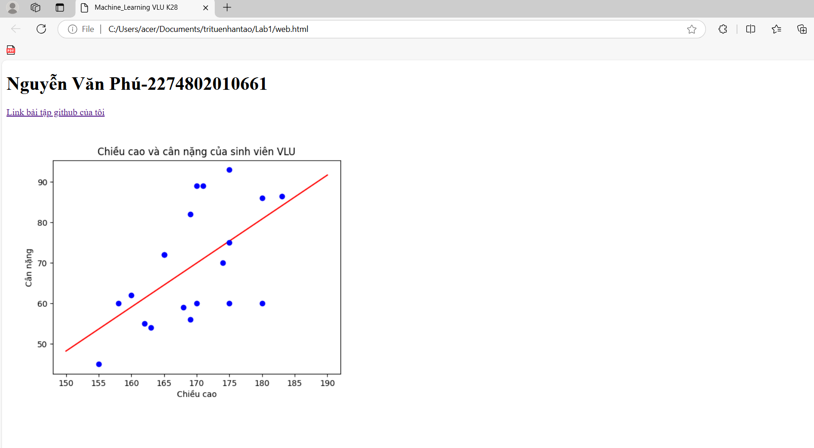
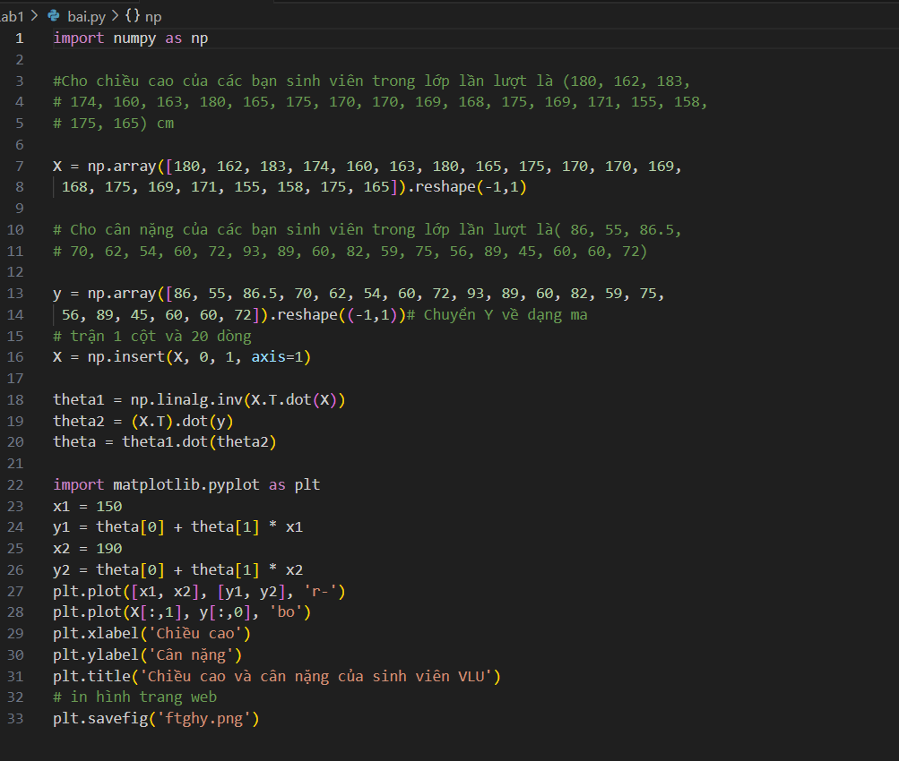

1. Công nghệ sử dụng
   + Framework: numpy, matplotlib, streamlit
2. Thuật toán  
3. Hiển thị kết quả lên website
# ảnh xuất ra web

# ảnh code bài tập

4. Đối với các bài Lab mà có sự đánh giá giữa các thuật toán thì các bạn nêu rõ ở mục 4 này.
