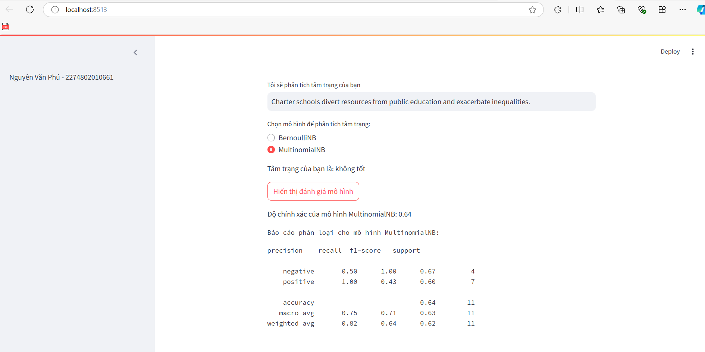
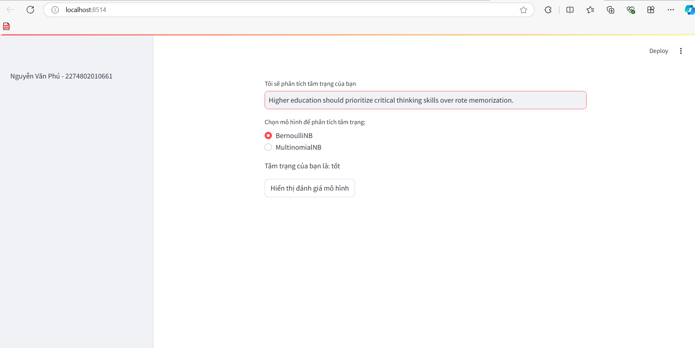
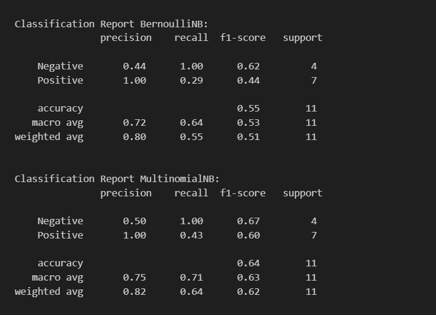
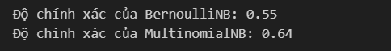
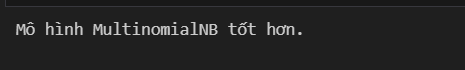

1. Công nghệ sử dụng
+ Framework: panda, Scikit-learn, numpy, streamlit
2. Thuật toán
+ Naive Bayes : là một kỹ thuật đơn giản để xây dựng bộ phân loại: các mô hình gán nhãn lớp cho các trường hợp vấn đề, được biểu diễn dưới dạng các vectơ giá trị đặc điểm, trong đó các nhãn lớp được rút ra từ một tập hợp hữu hạn.
3. Hiển thị kết quả lên website
+ 
+ 
4. Đối với các bài Lab mà có sự đánh giá giữa các thuật toán thì các bạn nêu rõ ở mục 4 này.
+ 
+ 
+ Kết quả so sánh
+ 