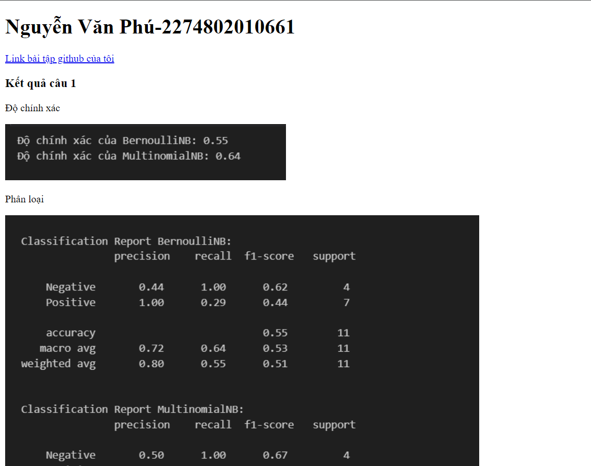
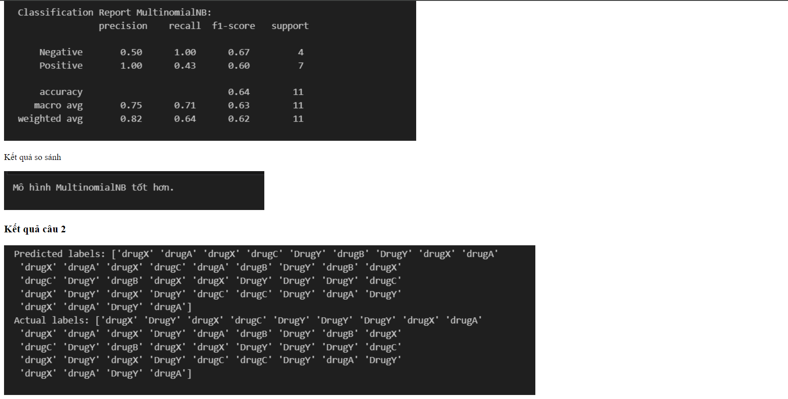
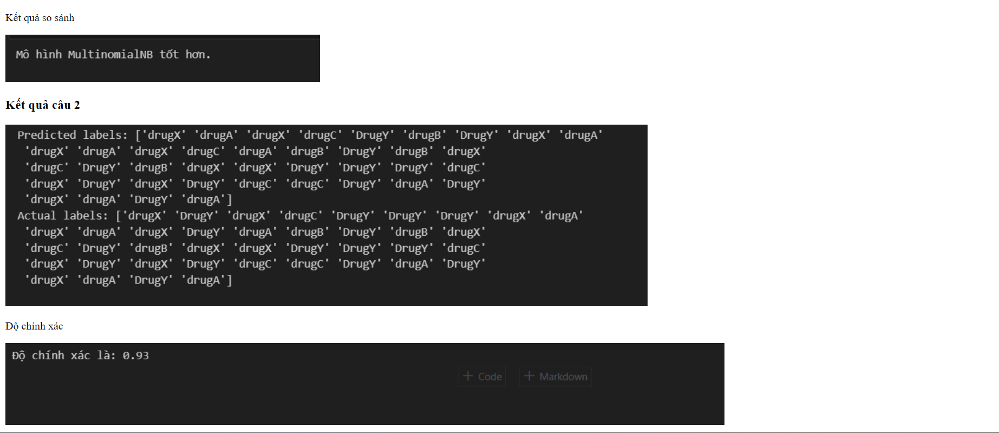

1. Công nghệ sử dụng
+ Framework: panda, Scikit-learn, numpy
2. Thuật toán
+ Naive Bayes : là một thuật toán dùng cho phân loại, đặc biệt khi dữ liệu có tính chất phân phối phù hợp với các giả định của mô hình. Nó thường được sử dụng như một phương pháp khởi đầu trong phân tích cảm xúc và phân loại văn bản, và nó có thể được cải thiện và kết hợp với các kỹ thuật khác để tăng cường độ chính xác.
3. Hiển thị kết quả lên website

4. Đối với các bài Lab mà có sự đánh giá giữa các thuật toán thì các bạn nêu rõ ở mục 4 này.

