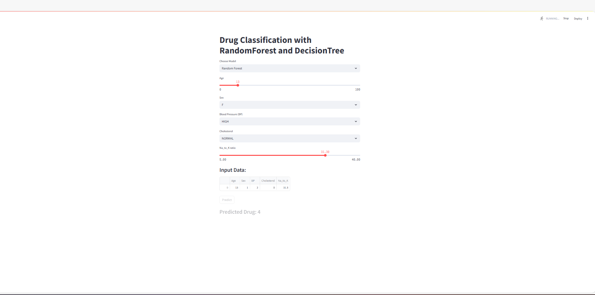
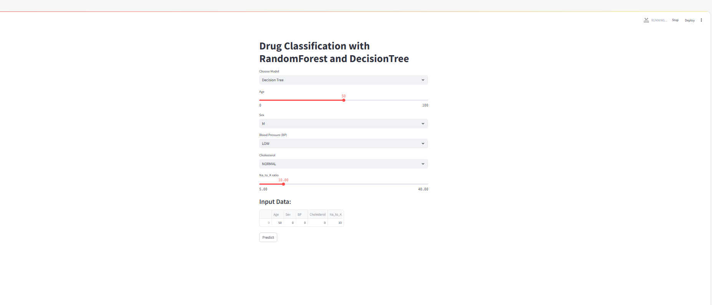

1. Công nghệ sử dụng
+ Framework: panda, numpy,streamlit, Scikit-learn
2. Thuật toán
+ DecisionTree: là một cấu trúc giống sơ đồ luồng được sử dụng để đưa ra quyết định hoặc dự đoán.
+ RandomForest: tổng hợp để phân loại, hồi quy và các nhiệm vụ khác hoạt động bằng cách tạo ra nhiều cây quyết định trong quá trình đào tạo.
3. Hiển thị kết quả lên website
+ 
+ 
4. Đối với các bài Lab mà có sự đánh giá giữa các thuật toán thì các bạn nêu rõ ở mục 4 này.
+ DecisionTree: Hiệu quả trên các tập dữ liệu đơn giản hoặc có ít đặc trưng, nhưng kém hơn trên các dữ liệu phức tạp hoặc có nhiều nhiễu.
+ RandomForest: Có hiệu quả tốt trên các tập dữ liệu phức tạp và nhiều đặc trưng. Việc sử dụng nhiều cây giúp mô hình ổn định hơn và ít bị ảnh hưởng bởi nhiễu.