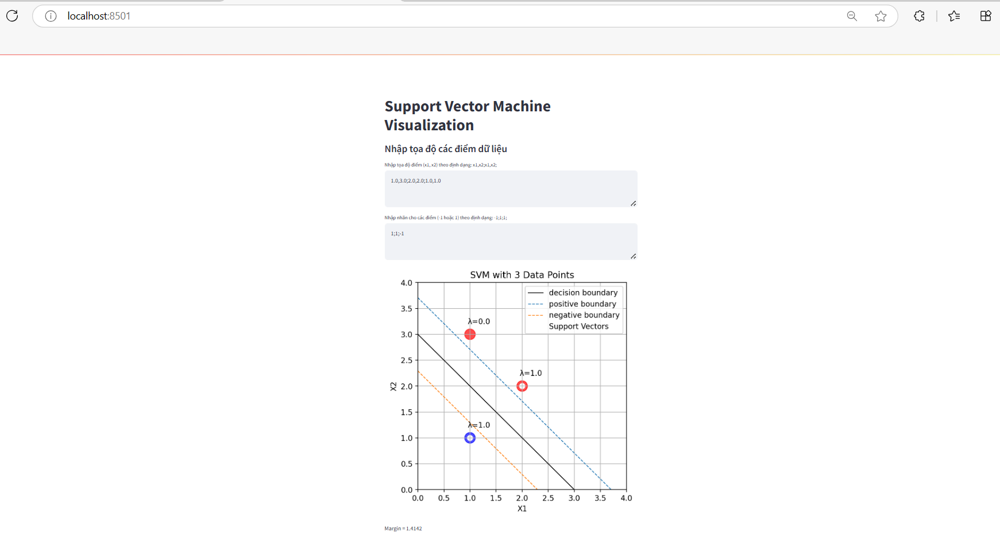
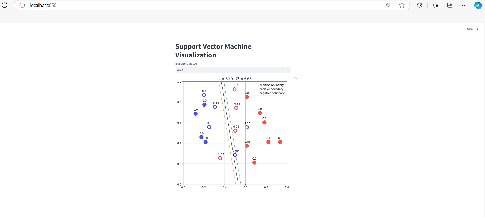
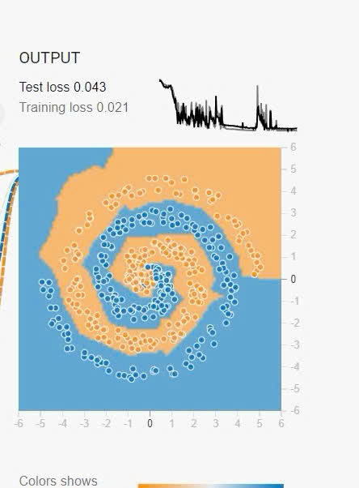

1. Công nghệ sử dụng
+ Framework: numpy, matplotlib, cvxopt (Quadratic Programming - QP)
2. Thuật toán
+ Sử dụng SVM: là 1 thuật toán học máy thuộc nhóm Supervised Learning (học có giám sát) được sử dụng trong các bài toán phân lớp dữ liệu (classification) hay hồi qui (Regression).
3. Hiển thị kết quả lên website
+ Kết quả bài 1
+ 
+ Kết quả bài 2
+ 
+ Bài tập thêm 
+ 
1. Đối với các bài Lab mà có sự đánh giá giữa các thuật toán thì các bạn nêu rõ ở mục 4 này.
