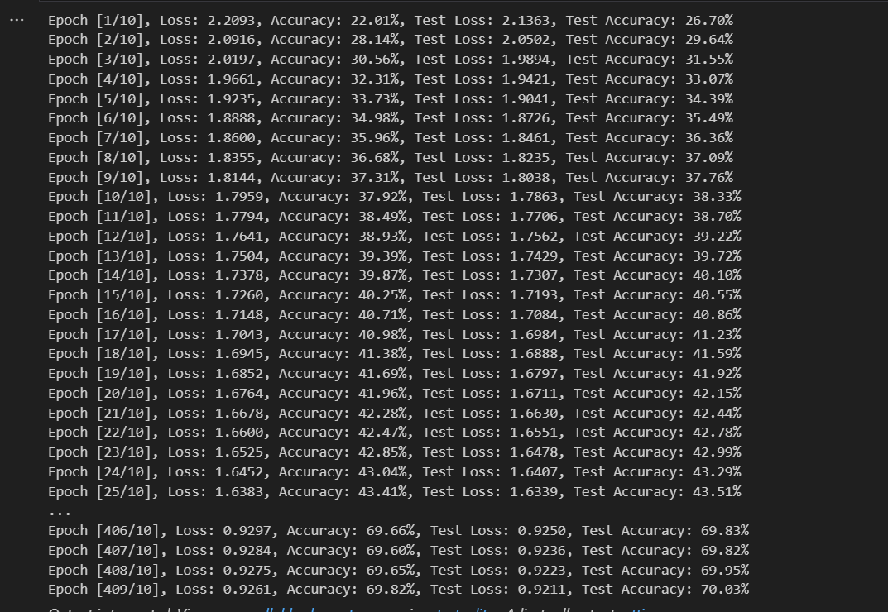
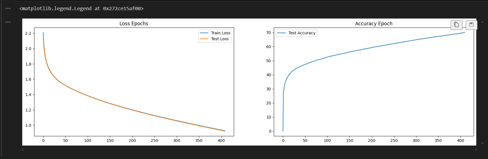
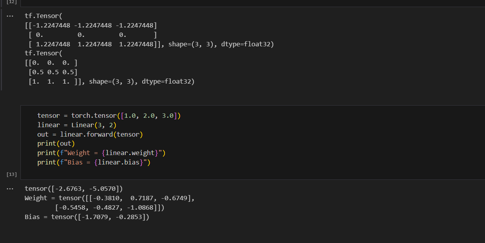

1. Công nghệ sử dụng
+ Framework: numpy, torchvision, torch, matplotlib, SGD (Stochastic Gradient Descent), ransforms
2. Thuật toán
+ MLP (Multi-Layer Perceptron), Z-Score Scaling và Min-Max Scaling
+ MLP: là một mô hình mạng nơ-ron rất mạnh mẽ cho phép học các hàm phi tuyến tính đối với dữ liệu phức tạp. Phương pháp này đặc biệt phù hợp với các tài liệu chữ, số viết tay, hỗ trợ phân loại và trích xuất nhanh chóng.
4. Kết quả
+ 
+ 
+ 