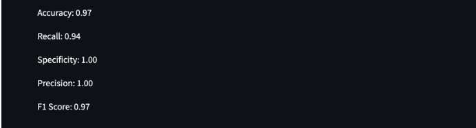

1. Công nghệ sử dụng
+ Framework: numpy, pandas, Sikit-learn
2. Thuật toán
+ KNN: Thuật toán sử dụng cho việc phân loại dữ liệu dựa trên việc tìm ra k điểm gần nhất trong tập huấn luyện của một điểm trong tập kiểm tra.
+ Confusion Matrix (Ma trận nhầm lẫn): Ma trận này sẽ cho biết kết quả dự đoán đúng và sai của mô hình
3. Kết quả
+ 