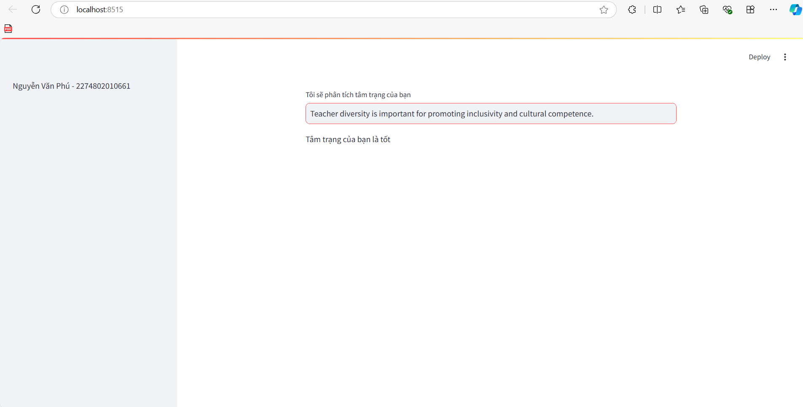

1. Công nghệ sử dụng
+ Framework: panda, numpy
2. Thuật toán
+ KNN: (K-nearest neighbors )là thuật toán học máy có giám sát, đơn giản và dễ triển khai. Thường được dùng trong các bài toán phân loại và hồi quy.
3. Hiển thị kết quả lên website
+ 
+ 
4. Đối với các bài Lab mà có sự đánh giá giữa các thuật toán thì các bạn nêu rõ ở mục 4 này.